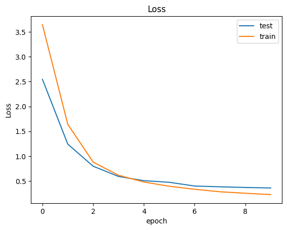
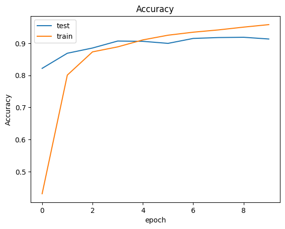
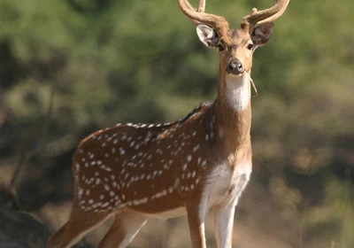
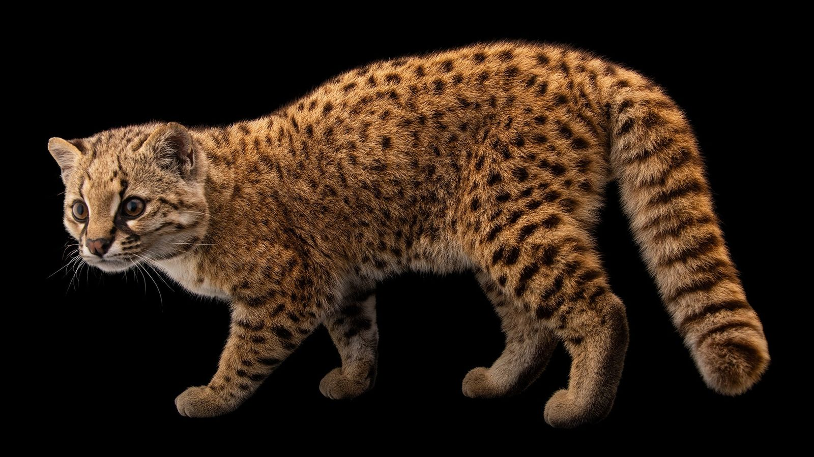
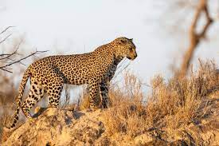
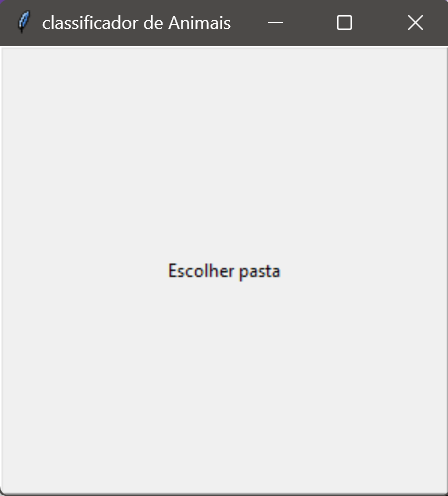

# Classificação de Animais
Classificação de imagens de animais (**contendo somente um animal por foto**) de um diretório selecionado.

Este projeto pode ser realizado em dois macro objetivos:
1. **Classificar imagens como animais ou "nenhum"**
2. **Criar uma interface para a seleção da pasta com imagens a serem classificadas**

## Classificação de Imagens

Para a classificação de animais, é necessário utilizar um modelo de classificação. Por isto, o seguinte pipeline foi seguido:
1. **Definição de dataset**
2. **Pré-processar o dataset**
3. **Definição de Modelo**
4. **Definição de Hiperparâmetros e Métricas**
5. **Treinamento do Modelo**
6. **Validação do Modelo**

### Definição de DataSet

O dataset [Animal Image Dataset (90 Different Animals)](https://www.kaggle.com/datasets/iamsouravbanerjee/animal-image-dataset-90-different-animals/data) foi utilizado como fonte das imagens de animais. Ele é composto por 5396 imagens de 90 classes diferentes, sendo em média 60 imagens por classe. Este dataset foi construído a partir de imagens do Google.
Para que o classificador possa inferir resultados em que não há nenhum animal, também foi utilizado um segundo dataset, [Stanford Background Dataset](https://www.kaggle.com/datasets/balraj98/stanford-background-dataset?select=images)(SBD), que é composto por imagens de cenas de paisagens (urbanas ou não), podendo conter objetos ou poucas pessoas.

### Pré-Processar o DataSet

Tendo os dois datasets, um dataset final foi criado juntando os dois. Como o dataset SBD contém 715 imagens, apenas 60 amostras aleatórias foram utilizadas, a fim de manter o dataset final balanceado.
O dataset final foi divido em datasets de treino e de teste, com proporções de 80% e 20% respectivamente. Como Há poucos dados por classe, não foi utilizado um dataset de validação.

### Definição do Modelo

Uma rede [ResNet50](https://pytorch.org/vision/main/models/generated/torchvision.models.resnet50.html#torchvision.models.resnet50) foi utilizada para a aplicação. A escolha de uma ResNet se deu devido à eficácia da arquitetura para tarefas de classificação (principalmente pelos seus blocos residuais), e por não ser uma rede muito complexa.
Foi utilizada a técnica do Transfer Learning, utilizando um modelo pré treinado (com a ImageNet-1k) do PyTorch.
A escolha do modelo específico da ResNet50 se deu devido ao custo-benefício entre sua acurácia obtida na ImageNet-1k e a complexidade do modelo.
Para reduzir *overfitting*, o classificador do modelo utilizou duas camadas *Fully Connected* e *Dropout*.

### Definição de Hiperparâmetros e Métricas

Os hiperparâmetros utilizados foram:
- `Learning Rate = 0.0001`
- `Épocas = 10`
- `Batch Size = 16`

A função de perda escolhida foi [CrossEntropyLoss](https://pytorch.org/docs/stable/generated/torch.nn.CrossEntropyLoss.html).
Já o otimizador foi o [Adam](https://pytorch.org/docs/stable/generated/torch.optim.Adam.html#adam), com `weight_decay=0.00001`.

### Treinamento do Modelo

Como mencionado, o treinamento do modelo foi realizado em 10 épocas. Por motivos de disponibilidade de hardware melhor, o modelo foi treinado em um *notebook* do *kaggle*, que pode ser encontrado neste [link](https://www.kaggle.com/code/brunotorresteles/animal-classification/notebook) ou na versão [local](docs/animal-classification.ipynb).

O treinamento levou aproximadamente 1:09 minutos por época, armazenando a perda e a acurácia de treino e de teste para cada época. Com os dados gerados os seguintes gráficos foram construídos:

### Validação do Modelo

O modelo obteve uma acurácia de teste de 91,8%. Um teste foi realizado, classificando as imagens do diretório [test_folder](test_folder/).

| imagens          | classificacao |
|------------------|---------------|
| antilope_1.webp  | veado         |
| asno.jpeg        | asno          |
| beija-flor.jpeg  | beija-flor    |
| cachorro_1.jpeg  | cão           |
| canguru.webp     | canguru       |
| carro.jpg        | nenhum        |
| cavalo.jpeg      | cavalo        |
| cobra_1.webp     | cobra         |
| cobra_2.jpeg     | cobra         |
| coiote.webp      | coiote        |
| gambá.jpg        | gambá         |
| gato.jpg         | leopardo      |
| gato_2.jpeg      | gato          |
| leopardo.jpeg    | leopardo      |
| pizza.jpeg       | ostra         |
| polvo.jpeg       | polvo         |
| raposa.jpeg      | raposa        |
| rinoceronte.jpeg | rinoceronte   |
| tigre_1.jpeg     | tigre         |
| tigre_2.jpeg     | tigre         |
| vaca.jpeg        | vaca          |
| vale.jpeg        | nenhum        |
| águia.jpeg       | águia         |

É possível observar que os resultados obtidos tiveram um bom grau de proximidade com o esperado, tendo algumas discrepâncias com a classificação de `antilope_1.webp`, `gato.jpg` e `pizza.jpeg`.
Isto pode se dar devido ao tamanho do dataset, contendo apenas aproximadamente 48 imagens de treino por classe. Também vale ressaltar que as imagens `antilope_1.webp` e `gato.jpg` apresentam semelhanças com suas classificações.

|Imagem|Ground Truth|Resultado Obtido| Semelhança|
|------|--------|------|--------|
||Antílope|Veado||
||Gato|Leopardo|

## Interface

A interface criada abre uma janela ao executar o arquivo [main.py](main.py), em que basta clicar no botão "Escolher pasta" e selecionar a pasta contendo as imagens a serem classificadas.

## Como utilizar

### Preparar ambiente

Utilizando Python 3.11
1. Criar um ambiente virtual: `python -m venv venv`
2. Ativar o ambiente virtual: `venv\Scripts\activate.bat` (No Windows)
3. Instalar as bibliotecas: `pip install -r requirements.txt`

### Rodar o programa
1. Ativar o ambiente virtual: `venv\Scripts\activate.bat` (Caso não esteja)
2. Executar o arquivo [main](main.py): `python main.py`
3. Selecionar pasta com imagens
4. Ao finalizar a classificação, o terminal retornará a mensagem `Classificação finalizada` e um arquivo `results.csv` estará criado na raiz do projeto.